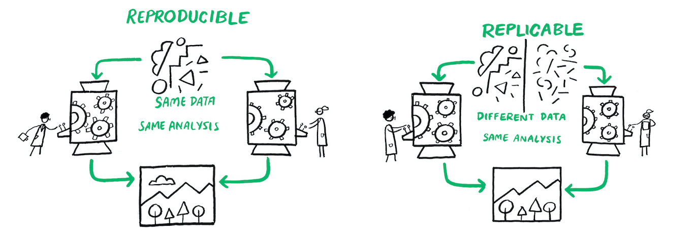

#  Reproducibilidad y Estructura de Proyectos


La investigación se fortalece si sus resultados pueden ser replicados y confirmados por varios investigadores independientes. Cuando los investigadores emplean transparencia en su investigación, es decir, cuando documentan y comparten adecuadamente los datos y procesos asociados con sus análisis, la comunidad investigadora en general puede ahorrar tiempo valioso al reproducir o basarse en los resultados publicados. A menudo, los datos o el código de proyectos anteriores son reutilizados por nuevos investigadores para verificar hallazgos anteriores o desarrollar nuevos análisis.

En este libro vamos a definir como investigación reproducible como el trabajo que puede ser recreado de manera independiente a partir de los mismos datos y el mismo código original. Replicabilidad por otro lado, es aplicar el mismo análisis a datos diferentes.  La reproducibilidad es distinta de la replicabilidad. Es decir, un trabajo reproducible es aquel en el que los resultados se mantienen idénticos si los códigos o los datos no han cambiado.

#####  Reproducibilidad versus Replicabilidad {- #fig:repro_repli}


*Nota: Esta figura fue tomada de* @TheTuringWay 


## Flujos de Trabajo Reproducibles


<div style="border: 1px solid #ccc; padding: 10px; background-color: #f9f9f9;">
<b> Reglas a recordar </b>

- Escribe siempre código
- Automatiza todo lo que se puedas automatizar.
- Escribe un único script que ejecute todo el código de principio a fin.

</div>

El trabajo con datos a menudo requiere miles o decenas de miles de líneas de código. Por lo tanto, para trabajar de manera transparente, debemos  adoptar tanto las técnicas estadísticas y metodológicas reproducibles, como las prácticas de flujo de trabajo y software que hagan que nuestro trabajo sea fácilmente reproducible por otros. 

Al diseñar flujos de trabajo reproducibles y compartirlos con los diferentes componentes de nuestro proyecto de investigación, permitimos que otros desarrollen una comprensión profunda de nuestro trabajo. Esto permite revisar nuestros métodos, probar nuestro código, proponer cambios útiles y hacer contribuciones para desarrollar aún más nuestro proyecto. Los flujos de trabajo reproducibles facilitan enormemente el proceso de revisión por pares al permitir a los revisores el acceso a las diferentes partes de los proyectos necesarias para validar los resultados de la investigación.

El objetivo de este capítulo es introducir las prácticas más importantes en este ámbito. Hay varias herramientas  que los investigadores pueden utilizar para asegurarse de que su trabajo sea reproducible. A continuación, discutimos las prácticas de flujo de trabajo. Al usar estas herramientas, un investigador se acercará al ideal de reproducibilidad de *"flujo de trabajo de un solo clic"*, es decir, ser capaces de ejecutar todo el análisis desde cero con un solo clic .

El código  es solo un aspecto de una estructura más amplia que denominamos "flujo de trabajo", que abarca la combinación de datos, código, organización y documentación. Todo, desde los nombres de archivos y variables hasta la organización de carpetas, el almacenamiento de datos y la programación eficiente y legible, forma parte del flujo de trabajo. 


#####  {- #fig:repro_journey}


*Nota: Esta figura fue tomada de* @TheTuringWay 


Antes de ofrecer detalles específicos sobre cómo escribir código reproducible, es importante mencionar una regla fundamental: **Escribe siempre código!!**. Escribe código en lugar de trabajar manualmente en tu entorno de programación estadística preferido. Esto significa:

1. No modificar datos manualmente, como con una hoja de cálculo. Es decir, evita usar  Excel si es posible.
2. No confiar en la línea de comandos, menús desplegables, u opciones de apuntar y hacer clic en software estadístico (como SPSS o Stata).
3. En su lugar, haz absolutamente todo con scripts.

La razón principal para esto es la reproducibilidad. Modificar datos en  Excel o cualquier programa similar de hojas de cálculo no deja un registro de los cambios realizados ni una explicación del razonamiento o el momento detrás de cualquier modificación. Aunque pueda parecer fácil o rápido limpiar datos una sola vez en Excel, o hacer cambios “menores” para que los datos sean legibles por el software estadístico preferido del investigador, a menos que estos cambios se escriban en detalle minucioso, este enfoque simplemente no es reproducible por otros investigadores. Es mejor escribir un script de programación que importe los datos sin procesar, haga todos los cambios necesarios, con comentarios en el código que expliquen esos cambios, y guarde cualquier conjunto de datos intermedios utilizado en el análisis. Luego, un investigador puede compartir sus datos originales y el código, y otros investigadores pueden reproducir su trabajo exactamente. No olvides que ese otro investigador podrías ser tú en unos meses.

Aunque entendemos que una buena cantidad de investigación se ha realizado usando menús desplegables en SPSS o Stata, desaconsejamos enfáticamente esta práctica. Como mínimo, si insistes en seguir esta ruta, utiliza las funciones de registro de comandos integradas en el software. En Stata, esto implica el comando `cmdlog`; en SPSS, implica usar el botón de pegar para agregar a un archivo de sintaxis. Al menos en ese caso, otros pueden ver los comandos que ejecutaste, incluso si no pueden reproducirlos fácilmente.

El ideal de transparencia en la investigación es hacer todo, incluyendo cambios como redondeos y formateo, mediante scripts. Incluso la descarga de datos desde sitios web se puede hacer a través de un script. Por ejemplo, en `R`, la función `download.file()` se puede usar para guardar datos de un sitio web. En Stata, el comando `copy` hace lo mismo. Por supuesto, esto abre la posibilidad de que el archivo de datos cambie en línea. 

Finalmente, aquí hay dos principios generales de organización:

1. Considera no guardar la salida estadística, sino solo guardar el código y los datos que la generan. Obviamente, esto sería irrealistamente tedioso para proyectos grandes (especialmente aquellos donde el análisis tarda días en ejecutarse), pero la idea es que deberías poder reproducir todos los pasos de tu análisis desde cero en cualquier momento.
2. Siempre comenta el código, cuanto más comentes tu código, y cuanto más describas el contenido de cada archivo de script, mejor serán la posibilidades de reproducción.

## Estructura de Proyectos

Un punto de partida natural para describir un buen flujo de trabajo es detallar una estructura básica de carpetas en el computador, nuestra sugerencia inspirada en @gentzkow2014code es la siguiente:


```
Complex Project Folder Estructure/
├── 01_build                    <- construcción de los datos
│   └── 01_input/
│       └── my_data.csv
│   └── 02_scripts/
│       └── clean_data.R
│   └── 03_output/
│       └── data_clean.csv
│   └── 04_temp/
│       └── temp_merge.csv
├── 02_analysis				   <- análisis de los datos
│   └── 01_input/
│       └── data_clean.csv
│   └── 02_scripts/
│       └── 01_regressions_table1.R
│       └── 02_regressions_fig1.R
│   └── 03_output/
│       └── 01_fig1.png
│       └── 02_table1.tex
│   └── 04_temp/
│       └── regressions.log
└── 03_Document                 <- Document
    └── Document.Rmd         <- script documento dinámico
   
```


 Por supuesto, los detalles variarán para diferentes tipos de investigación y los gustos de diferentes académicos, pero muchos proyectos pueden tener una estructura de archivos similar a la organización básica mostrada aquí. En primer lugar, necesita crear una carpeta maestra con un nombre corto pero descriptivo para el proyecto, un nombre que sea significativo tanto para usted como para sus colaboradores. 
 
 


### Creando la estructura de proyecto automáticamente

Una opción para la creación de esta estructura es simplemente tener un script que lo hace por nosotros. Para ello utilizaremos un `script` en `Bash` que crea la estructura de carpetas descriptas anteriormente. 

```sh
#!/bin/bash

# Crear directorios de nivel superior
mkdir -p 01_build 02_analysis 03_document

# Crear subdirectorios dentro de build y analysis
for dir in 01_build 02_analysis
do
  mkdir -p ./$dir/01_input
  mkdir -p ./$dir/02_scripts
  mkdir -p ./$dir/03_output
  mkdir -p ./$dir/04_temp
done

# Navegar al directorio 02_analysis/03_output y crear subdirectorios
cd 02_analysis/03_output
mkdir -p Figures Tables

# Volver al directorio principal
cd ../..

# Crear un archivo README.txt en blanco
touch README.txt

echo "¡Carpetas creadas exitosamente!"
```

El script realiza 5 operaciones

1. **Shebang (`#!/bin/bash`)**: Indica que el script debe ejecutarse con Bash.
2. **Creación de directorios de nivel superior**: `mkdir -p 01_build 02_analysis 03_document` crea tres carpetas principales: `01_build`, `02_analysis`, y `03_document`.
3. **Creación de subdirectorios**: Un bucle `for` recorre los directorios `01_build` y `02_analysis`, creando cuatro subcarpetas dentro de cada uno: `01_input`, `02_scripts`, `03_output`, y `04_temp`.
4. **Navegar y crear más subdirectorios**: El script navega a `02_analysis/03_output` y crea dos subcarpetas más: `Figures` y `Tables`.
5. *Creación de un archivo README.txt*: El script regresa al directorio principal y crea un archivo en blanco llamado `README.txt`
6. **Mensaje de confirmación**: `echo "¡Carpetas creadas exitosamente!"` imprime un mensaje indicando que el proceso se ha completado.


Alternativamente, tambien puedes incluir texto en tu archivo de README.txt

```sh
#!/bin/bash

# Crear directorios de nivel superior
mkdir -p 01_build 02_analysis 03_document

# Crear subdirectorios dentro de build y analysis
for dir in 01_build 02_analysis
do
  mkdir -p ./$dir/01_input
  mkdir -p ./$dir/02_scripts
  mkdir -p ./$dir/03_output
  mkdir -p ./$dir/04_temp
done

# Navegar al directorio 02_analysis/03_output y crear subdirectorios
cd 02_analysis/03_output
mkdir -p Figures Tables

# Volver al directorio principal
cd ../..

# Crear el archivo README.txt con la estructura de carpetas y la descripción
cat <<EOL > README.txt
Estructura de Carpetas:

01_build
├── 01_input
├── 02_scripts
├── 03_output
└── 04_temp

02_analysis
├── 01_input
├── 02_scripts
├── 03_output
│   ├── Figures
│   └── Tables
└── 04_temp

03_document

Descripción de Carpetas:

01_build:
  - 01_input: Contiene archivos de entrada para el proceso de construcción.
  - 02_scripts: Contiene scripts utilizados para el proceso de construcción.
  - 03_output: Contiene los resultados del proceso de construcción.
  - 04_temp: Contiene archivos temporales generados durante el proceso de construcción.

02_analysis:
  - 01_input: Contiene archivos de entrada para el análisis.
  - 02_scripts: Contiene scripts utilizados para el análisis.
  - 03_output: Contiene los resultados del análisis.
    - Figures: Contiene figuras generadas por el análisis.
    - Tables: Contiene tablas generadas por el análisis.
  - 04_temp: Contiene archivos temporales generados durante el análisis.

03_document:
  - Contiene documentos relacionados con el proyecto.
EOL

echo "¡Carpetas y README.txt creados exitosamente!"

```
#### Cómo Ejecutar el Script en Windows


Sí, puedes usar GitHub Desktop para instalar Git Bash y ejecutar scripts de Bash en Windows. Aquí están las instrucciones detalladas:


1. **Paso 1**: Instalar **GitHub Desktop**. Para descargar e Instalar GitHub Desktop ve a [desktop.github.com](https://desktop.github.com) y descarga GitHub Desktop y sigue las instrucciones de instalación. Asegurarse que [Git](https://www.git-scm.com/) haya sido instalado, de caso contrario crearlo.

2. **Paso 2**: Crear y guardar el Script. Para ello primero abre Notepad o cualquier editor de texto y luego copia el `script` anterior en el editor. Finalmente, guarda el archivo con la extensión `.sh`, por ejemplo, `create_folders.sh`.

3. **Paso 3**: Ejecutar el Script Usando Git Bash:

    3.1. Abre GitHub Desktop y crea un repositorio. En el explorador de Windows, busca la carpeta del repositorio.
    
    3.2 Haz click derecho con el mouse  para abrir Git Bash.
    
    3.3. Una vez en la terminal ejecuta el archivo hacieno `sh create_folders.sh`
    

*Porque usamos Git Bash y no la terminal de windows? Preferimos Git Bash porque es una herramienta que proporciona un entorno similar a UNIX/Linux en Windows, ideal para desarrolladores que necesitan usar comandos de Git y scripts de Bash. Emula una terminal Bash con comandos y utilidades típicas de UNIX, lo que facilita la compatibilidad con herramientas y flujos de trabajo de desarrollo de sistemas basados en UNIX. Por otro lado, la terminal de Windows (Command Prompt) es el intérprete de comandos predeterminado en Windows, diseñado para ejecutar comandos nativos de Windows y scripts batch, siendo más adecuada para tareas administrativas y operaciones específicas del sistema operativo Windows.*

#### Cómo Ejecutar el Script en Mac

1. **Paso 1**: Crear y guardar el Script. Abre un editor de texto, copia el `script` y guárdalo con la extensión `.sh`, por ejemplo, `create_folders.sh`.

2. **Paso 2**: Abrir la Terminal. Ve a `Aplicaciones` > `Utilidades` > `Terminal`.

3. **Paso 3**: Navegar al Directorio del Script:

    3.1. Usa el comando `cd` para ir al directorio donde guardaste el script. Por ejemplo: `cd /Users/TuUsuario/PathToScript`
    
    3.2. Haz el script ejecutable, para ello ejecuta: `chmod +x create_folders.sh`
    
    3.3. Finalmente, ejecuta el script haciendo `./create_folders.sh` y las carpetas quedarán creadas en tu directorio.
    
    
## Gestión de Rutas en los Directorios de Trabajo


Muchos entornos de programación tienen un concepto poderoso de la "ruta de trabajo" o "directorio de trabajo". Este es el lugar donde el software busca los archivos que le pides que cargue y donde guardará cualquier archivo que le pidas que guarde. Por ejemplo, en algunos entornos, la ruta de trabajo actual se muestra en la parte superior de la consola o ventana principal del software.

Es importante siempre usar rutas de directorios relativas (como `./Data` y no `C:/Usuarios/Ignacio/Documentos/Proyecto/Datos`) para que los usuarios en otras computadoras no tengan que renombrar cada referencia a un archivo y puedan en su lugar solo cambiar o asignar un directorio global una vez.

En `R` puedes ver tu ruta completa ejecutando `getwd()`:

```r
getwd()
#> [1] "/Usuarios/Ignacio/Documentos/Proyecto/Datos"
```

En esta sesión de `R`, el directorio de trabajo actual (piénsalo como "inicio") está en la carpeta Documentos de Ignacio, en una subcarpeta llamada Datos Este código devolverá un resultado diferente cuando lo ejecutes, porque la estructura de directorios de tu computadora es diferente a la de Ignacio.

Puedes establecer el directorio de trabajo desde `R`, pero **NO** lo recomendamos:

```r
setwd("/ruta/a/mi/ProyectoGenial")
```

Establecer el directorio de trabajo usando `setwd()` puede parecer una solución sencilla, pero presenta varias desventajas importantes. Primero, afecta la reproducibilidad y la colaboración, ya que configura un directorio de trabajo específico que es local a tu máquina, lo que puede causar problemas cuando otros intenten ejecutar tu script en sus propias computadoras, debido a las diferentes estructuras de directorios. Usar rutas relativas, en cambio, asegura que el código sea más portátil y fácil de compartir.

Además, herramientas como RStudio permiten crear proyectos que automáticamente establecen el directorio de trabajo al directorio del proyecto, eliminando la necesidad de `setwd()` y facilitando la organización y gestión del proyecto. Mantener el código libre de `setwd()` fomenta mejores prácticas de organización y reduce la probabilidad de conflictos, ya que establecer manualmente el directorio de trabajo puede llevar a errores difíciles de depurar, especialmente si se ejecutan múltiples `scripts` o se trabaja en diferentes proyectos simultáneamente.

Finalmente, en flujos de trabajo automatizados o en entornos de producción, depender de `setwd()` puede ser problemático. Es preferible tener `scripts` que sean independientes de la configuración del directorio de trabajo y que funcionen correctamente sin necesidad de ajustes manuales. En resumen, evitar el uso de `setwd()` y utilizar rutas relativas mejora la reproducibilidad, facilita la colaboración y se alinea con las mejores prácticas de programación.

Hay una mejor manera; una forma que también te pone en el camino para gestionar tu trabajo en R como un experto. Esa manera es el proyecto de RStudio.


### Proyectos en RStudio

Mantener todos los archivos asociados con un proyecto (datos de entrada, scripts de R, resultados analíticos y figuras) juntos en un directorio es una práctica tan común como sabia que `RStudio` ha incorporado esto a través de **proyectos**. Para crear un proyecto hay que hacer clic en `Archivo > Nuevo Proyecto` y seguir los pasos mostrados en la siguiente figura.


```{r}
#| label: fig-new-project
#| echo: false
#| fig-cap: | 
#|   To create new project: (top) first click New Directory, then (middle)
#|   click New Project, then (bottom) fill in the directory (project) name,
#|   choose a good subdirectory for its home and click Create Project.
#| fig-alt: |
#|   Three screenshots of the New Project menu. In the first screenshot, 
#|   the Create Project window is shown and New Directory is selected. 
#|   In the second screenshot, the Project Type window is shown and 
#|   Empty Project is selected. In the third screenshot, the Create New
#|   Project  window is shown and the directory name is given as r4ds and
#|   the project is being created as subdirectory of the Desktop.
#| out-width: ~

knitr::include_graphics("figs/new-project.png")
```
*Nota: Esta figura fue tomada de* @wickham2023r 

En este caso llamamos al proyecto `r4ds`. Una vez que completo este proceso, tendremos un nuevo proyecto de `RStudio` solo para este proyecto. Podemos verificar que el "inicio" de tu proyecto sea el directorio de trabajo actual:

```{r}
#| eval: false
getwd()
#> [1] /Usuarios/Ignacio/Documents/r4ds
```

Mas aún la carpeta asociada con tu proyecto observaremos el archivo `.Rproj`. Haciendo doble clic en ese archivo para reabrir el proyecto. Nota que vuelves a donde lo dejaste: es el mismo directorio de trabajo e historial de comandos, y todos los archivos en los que estabas trabajando siguen abiertos. Porque seguiste nuestras instrucciones anteriores, tendrás, sin embargo, un entorno completamente fresco, garantizando que comienzas con una pizarra limpia.

Una vez que estés dentro de un proyecto, deberías usar siempre rutas relativas y no rutas absolutas. ¿Cuál es la diferencia? Una ruta relativa es relativa al directorio de trabajo, es decir, al directorio del proyecto.  Las rutas absolutas apuntan al mismo lugar independientemente de tu directorio de trabajo. Se ven un poco diferentes dependiendo de tu sistema operativo. En Windows comienzan con una letra de unidad (por ejemplo, `C:`) o dos barras invertidas (por ejemplo, `\\nombre_del_servidor`) y en Mac/Linux comienzan con una barra "/" (por ejemplo, `/usuarios/ignacio`). Nunca deberías usar rutas absolutas en tus scripts, porque dificultan el compartir: nadie más tendrá exactamente la misma configuración de directorio que tú.

Hay otra diferencia importante entre los sistemas operativos: cómo separas los componentes de la ruta. Mac y Linux usan barras inclinadas (por ejemplo, `data/geiser.csv`) y Windows usa barras invertidas (por ejemplo, `data\geiser.csv`). R puede trabajar con cualquiera de los dos tipos (sin importar en qué plataforma estés usando), pero desafortunadamente, las barras invertidas tienen un significado especial para R, y para obtener una sola barra invertida en la ruta, necesitas escribir dos barras invertidas. ¡Eso hace que la vida sea frustrante, por lo que recomendamos siempre usar el estilo de Linux/Mac con barras inclinadas hacia adelante.


### Rutas de Archivos y el Paquete {here}

Una de las grandes frustraciones al compartir un proyecto de `RStudio` con un colaborador es que es común referirse a archivos con `rutas de archivos absolutas` que son específicas de tu computadora.

Desafortunadamente, los archivos inevitablemente no estarán en el mismo lugar en la computadora de tu colaborador, y todas las referencias de ruta para cargar o escribir/guardar archivos no funcionarán.

Esta frustración ha llevado a personas razonables a amenazar con incendiar la computadora y a proponer mejores enfoques.

#####  {- #fig:arson}

*Nota: Esta figura fue tomada de* [Bryan 2017](https://www.tidyverse.org/blog/2017/12/workflow-vs-script/)

Para tener un conjunto de rutas de archivos que funcionen en **cualquier** computadora que tenga una copia de tu Proyecto, necesitas usar el paquete {here}. Para instalarlo y ejecutarlo podemos hacer,

```{r}
#| eval: false
 install.packages("here")
library(here)
here()
#> [1] /Usuarios/Ignacio/Documents/r4ds
```

Cuando ejecutamos la función `here()` esto nos devolverá la ruta a tu Proyecto actual. Esencialmente, determina dónde está el directorio de tu proyecto y proporciona esto como una base. Esto se puede usar para referenciar otras carpetas en tu proyecto de manera relativa. La función `here()` proporciona los detalles de la ruta del archivo hasta la carpeta de tu Proyecto de RStudio, y luego puedes agregar cualquier subcarpeta o detalles del nombre del archivo dentro de los paréntesis. 

Ahora, cuando compartas el Proyecto con un colaborador, las rutas de archivo para leer y escribir archivos funcionarán correctamente.


## Nombrar archivos

Cómo nombras archivos y directorios puede no parecer un punto importante, pero puede causar un gran dolor de cabeza si intentas usar código para automatizar procesos, y en el mejor de los casos, solo ralentiza las cosas. Hay una ciencia para elegir buenos nombres de archivos también.

En general, es útil nombrar los archivos de código con un título corto y útil que describa su función, junto con un número al principio, para que el orden de ejecución de los archivos de código sea claro, como:
```
01-importar-limpiar_datos_redcap.R
02-importar-limpiar_datos_almacen.R
03-unir_datos_redcap_almacen.R
```
Estos se ordenarán y organizarán fácilmente en tu carpeta, ya que los números al principio ayudan a organizarlos.

También es útil numerar y nombrar claramente tus archivos de datos. Estos generalmente deben corresponder a los archivos de código que los crearon. Al final de un paso de código, puedes guardar/escribir tu archivo de datos resultante en un archivo `*.rda` o un archivo `*.csv`, para ser cargado al inicio del siguiente archivo de código. Estos podrían verse así:

```
01-datos_limpios_redcap.csv
02-datos_limpios_almacen.csv
03-datos_unidos_redcap_almacen.csv
```

Observa que estamos utilizando un esquema de nombres 'segmentados', de modo que los archivos tienen un patrón de nombres consistente con segmentos en el mismo orden, y los segmentos distintos están separados por guiones bajos, mientras que los segmentos informativos compuestos por más de una palabra están separados por guiones.

Es sorprendentemente importante ser reflexible sobre tu esquema de nombres segmentados desde el principio, ya que puede ayudarte de muchas maneras a organizar, ordenar y manipular archivos más adelante.

Puede ser tentador nombrar tus archivos `code.R` o `myscript.R`, pero deberías pensar un poco más antes de elegir un nombre para tu archivo. Tres principios importantes para nombrar archivos son los siguientes:

<div style="border: 1px solid #ccc; padding: 10px; background-color: #f9f9f9;">
- Debe ser legible por máquinas
- Debe ser legible por humanos
- Debe ordenarse bien en un directorio
</div>


Buenos nombres de archivos son legibles por computadoras, legibles por humanos y funcionan bien con el orden predeterminado. Desglosamos estos tres criterios uno por uno.

### Nombres de archivos legibles por computadora

¿Qué hace que un nombre de archivo sea legible por computadora? Primero, los archivos legibles por computadora no contienen espacios, puntuación ni caracteres especiales. Recuerda estas sabias palabras de Aaron Quinlan, un bioinformático, ["un espacio en un nombre de archivo es un espacio en el alma de uno"](https://x.com/aaronquinlan/status/711593127551733761). Son consistentes en el uso de mayúsculas, lo que significa que siempre sigues el mismo patrón de mayúsculas, ya sea todo en minúsculas, camel case (`EstoEsLoQueQuieroDecirPorCamelCase`) o cualquier otro. Finalmente, los buenos nombres de archivos hacen un uso deliberado de delimitadores de texto. El uso prudente de delimitadores facilita la búsqueda de patrones cuando buscas un archivo específico. Generalmente, se recomienda usar un guion bajo (`_`) para delimitar unidades de metadatos y un guion (-) para delimitar palabras dentro de una unidad de metadatos. Por ejemplo, aquí hay un buen nombre de archivo legible por computadora:

```
2024-06-17_ciencia-abierta_clase-01.pptx
```

### Nombres de archivos legibles por humanos

El nombre de archivo de ejemplo anterior no solo es legible por computadora, también es legible por humanos. Esto significa que un humano puede leer el nombre del archivo y tener una idea bastante buena de lo que hay en ese archivo. ¡Los buenos nombres de archivos son informativos! No debes tener miedo de usar nombres largos si eso es lo que se necesita para hacerlos descriptivos.

### Nombres de archivos que funcionan bien con el orden predeterminado

Si ordenas tus archivos alfabéticamente en una carpeta, quieres que se ordenen de una manera que tenga sentido. Ya sea que ordenes tus archivos por fecha o por un número secuencial, el número siempre va primero. Para las fechas, usa el formato AAAAMMDD, o tus archivos creados en abril de 1984 y 2020 estarán más cerca que los creados en marzo y abril de 2020. Si estás utilizando una numeración secuencial, agrega una cantidad sensata de ceros al frente según la cantidad de archivos de esa categoría que esperas tener en el futuro.


## Buenas prácticas para escribir código


Cada pieza de código que escribes tiene múltiples audiencias. La audiencia más importante es la computadora: si el código no entrega instrucciones inequívocas y correctas, el resultado no será el que pretendes.

Pero el código también tiene otras audiencias. En algún momento, tú, tu coautor, tu asistente de investigación o alguien que desee reproducir tus hallazgos necesitará mirar el código para entenderlo o modificarlo.

Un buen código se escribe teniendo en cuenta a todas estas audiencias. A continuación, recopilamos algunos de los principios más importantes que hemos aprendido sobre cómo escribir buen código.


### Mantén el código modular

Para garantizar la reproducibilidad en proyectos, es generalmente más efectivo utilizar múltiples archivos, cada uno encargado de una tarea específica. Esta estrategia ofrece varias ventajas importantes:

1. Dividir el proyecto en múltiples scripts que realicen tareas específicas facilita la comprensión, el mantenimiento y la actualización del código. Cada `script` puede enfocarse en una parte del flujo de trabajo. Esto permite modificar o actualizar una parte del proyecto sin afectar a las demá.

2.  Con scripts modulares, es más fácil reutilizar código en diferentes proyectos o en diferentes etapas del mismo proyecto. Por ejemplo, un script que contiene una funcion puede ser reutilizado en múltiples partes del análisis】.

3.  En un entorno de trabajo colaborativo, tener scripts separados permite que diferentes miembros del equipo trabajen en diferentes partes del proyecto simultáneamente. Esto reduce los conflictos de código y facilita la integración de los cambios a través de sistemas de control de versiones como Git

4. Es más sencillo depurar y probar scripts individuales que un único archivo monolítico. Puedes desarrollar pruebas unitarias para cada script, asegurándote de que cada parte del proceso funciona correctamente antes de integrar todo el flujo de trabajo.

Por tanto, dividir un proyecto en múltiples archivos específicos para cada tarea no solo mejora la organización y mantenibilidad del código, sino que también facilita la colaboración y asegura una mejor reproducibilidad de los resultados.

### Mantén el código corto y con propósito

Ninguna línea de código debería tener más de 100 caracteres. Los scripts largos deben dividirse en funciones más pequeñas. Las funciones individuales no deberían tener normalmente más de 80 líneas. Los `scripts` no deberían ser más largos que unos pocos cientos de líneas. Si te resulta difícil hacer que un `script` largo sea corto y con propósito, es una señal de que necesitas reflexionar sobre la estructura lógica del directorio en su conjunto. Cada `script` y función debería tener un propósito claro e intuitivo. Parte el código y recuerda mantenerlo modular

### Haz que tus funciones sean tímidas

Muy relacionado con los dos puntos anteriores, es importante que las funciones sean timidas. Este principio muy utilizado en programación, (*Make your functions shy*) se refiere a que  las funciones, y los `scripts`, deben ser pequeñas, específicas y limitadas en su alcance. 

El lector debe saber exactamente qué variables usa una función como entradas y qué variables puede potencialmente cambiar. La mayoría de las funciones deberían declarar explícitamente sus entradas y salidas y solo operar con variables locales. Es importante, que el conjunto de entradas y salidas sea lo más pequeño posible; las funciones deberían ser reacias a tocar más datos de los necesarios. Por ejemplo, si una función solo depende del parámetro beta, pásale solo beta y no todo el vector de parámetros. Usa variables globales raramente, si es que alguna vez lo haces.

Esto es porque las funciones "tímidas" deben ocultar su complejidad interna y solo exponer lo necesario para su uso. Esto significa que deben tener una interfaz clara y sencilla, sin revelar detalles internos de su implementación.

Además funciones pequeñas y específicas son más fáciles de reutilizar en diferentes partes del código y más fáciles de mantener y probar. Si una función es demasiado grande o hace demasiadas cosas, se vuelve más difícil de entender, depurar y modificar sin introducir errores. Al mismo tiempo.; as funciones "tímidas" tienden a depender menos de su contexto exterior, lo que significa que tienen menos efectos secundarios y son más predecibles. Esto facilita poder hacer pruebas y reduce la posibilidad de errores debido a cambios en otras partes del código.


### Ordena tus funciones para una lectura lineal

Un lector debería poder leer tu código de arriba hacia abajo sin tener que saltar de un lado a otro. Las subfunciones deben aparecer inmediatamente después de las funciones de nivel superior que las llaman.

### Usa nombres descriptivos

Los buenos nombres reemplazan los comentarios y hacen que el código se auto-documente. Por defecto, los nombres de variables, funciones, archivos, etc. deben consistir en palabras completas. Usa abreviaturas solo cuando estés seguro de que un lector no familiarizado con tu código las entendería y no haya ambigüedad. La mayoría de los economistas entendería que “income_percap” significa ingreso per cápita, por lo que no es necesario escribir income_percapita. Pero income_pc podría significar muchas cosas diferentes dependiendo del contexto. Abreviaturas como `st`, `cnty` y `hhld` están bien si se usan de manera consistente en todo el cuerpo del código. Pero usar `blk_income` para representar el ingreso en un bloque censal podría ser confuso.

Evita tener múltiples objetos cuyos nombres no dejen claro cómo son diferentes: por ejemplo, scripts llamados `state_level_analysis.do` y `state_level_analysisb.do` o variables llamadas `x` y `xx`.

Los nombres pueden ser más cortos o más abreviados cuando los objetos que representan se usan frecuentemente y/o muy cerca de donde se definen. Por ejemplo, a veces es útil definir nombres cortos para usar en cálculos algebraicos. Esto es difícil de leer:

```stata
log_coefficient = log((income_percap' * income_percap)^(-1) *///
```

Esto es mejor:

```stata
X = income_percap
Y = log_wage
log_coefficient = log((X'*X)^(-1)*X'*Y)
```

### Sé consistente

Hay muchos puntos de estilo de codificación que son en su mayoría una cuestión de gusto. Por ejemplo, a veces la gente escribe nombres de variables como hhld_annual_income y otras veces como hhldAnnualIncome. Aunque algunas personas tienen opiniones fuertes sobre cuál es mejor, no nos importa. Lo importante es que todos en un equipo usen convenciones consistentes. Esto es especialmente importante dentro de los scripts: si estás editando un programa en el que todos los scripts usan indentación de dos espacios, deberías usar también la indentación de dos espacios, incluso si eso rompe la regla normal. (O, deberías usar grep para actualizar el script a la indentación de cuatro espacios).


### Comenta el código

Nunca puedes comentar demasiado tu código. Los comentarios deben realmente explicar lo que hace el código en lugar de simplemente transliterar—es más útil describir `x<-1` con “inicializar el conteo de población a 1” que “establecer x igual a 1.” Los comentarios también deben ser revisados para asegurarse de que no transmitan información inexacta y no queden desactualizados.


### Indenta el código

La indentación del código es crucial en la programación por varias razones, independientemente del lenguaje de programación o entorno de desarrollo utilizado (Somos demasiado inteligentes para opinar sobre el debate de espacios vs. tabulaciones).

La indentación adecuada hace que el código sea más fácil de leer y entender. Los desarrolladores pueden seguir la estructura lógica del código, lo que facilita la comprensión de su funcionamiento y la identificación de secciones específicas. Un código bien indentado reduce el esfuerzo necesario para revisar y mantener el código.

La indentación ayuda a organizar el código en bloques lógicos, mostrando claramente dónde comienzan y terminan las estructuras de control como bucles, condiciones y funciones. Esto es especialmente útil en lenguajes donde la indentación es una parte sintáctica del lenguaje, como Python, pero también es beneficioso en otros lenguajes.

Un código mal indentado puede llevar a errores difíciles de detectar. La estructura visual proporcionada por la indentación adecuada ayuda a evitar errores lógicos y de sintaxis, permitiendo a los desarrolladores ver más fácilmente las relaciones entre diferentes partes del código.


### No dejes desorden

No dejes desorden—elimina valores intermedios temporales o archivos necesarios. Mantener el código libre de valores y archivos temporales innecesarios mejora la legibilidad y la mantenibilidad. Un código desordenado con variables y archivos temporales puede confundir a otros investigadores o incluso al mismo autor al volver a revisar el código tiempo después. Usar prefijos como `temp_` o `x_` para identificar estos elementos o guardarlos en una carpeta dedicada ayuda a gestionarlos mejor y a eliminarlos cuando ya no son necesarios.

No eliminar  valores temporales o intermedios puede llevar a errores si se usan accidentalmente en lugar de las variables correctas. Eliminar estos valores una vez que han cumplido su propósito reduce el riesgo de errores lógicos y facilita la depuración del código

En Stata, por ejemplo, se pueden utilizar las funcionalidades `tempfile` y `tempvar` para manejar archivos y variables temporales de manera eficiente. Estos comandos crean referencias temporales que son automáticamente eliminadas al final de la sesión o del script, ayudando a mantener el entorno de trabajo limpio y ordenado.

```stata
tempfile tempdata
save `tempdata', replace

tempvar tempvar1
gen `tempvar1' = var1 + var2
```


## Gestión de Paquetes Estadísticos

Es un error común suponer que los paquetes de software avanzados siempre producirán los mismos resultados exactos a través de diferentes versiones de software y plataformas. Sin embargo, a menudo esto no es así, especialmente con paquetes escritos por usuarios. (Para un ejemplo en economía que demuestra la importancia de este problema con la estimación numérica no lineal, ver @mccullough2003verifying).

Como mínimo, los investigadores siempre deben incluir información sobre qué versión del software utilizaron para ejecutar sus programas. La información sobre la versión del software se puede determinar usando el comando `sessionInfo()` en `R`, y los usuarios de `Stata` deben incluir el comando `version` en `scripts` para asegurar que los usuarios con versiones más nuevas de `Stata` usen los mismos algoritmos. Desafortunadamente, esto todavía no es garantía, ya que los algoritmos desactualizados o incorrectos no se reproducen en versiones más nuevas de `Stata.` Los usuarios de Python pueden usar el comando `pip list` o `pip freeze` para listar las versiones de todos los paquetes instalados, y crear un archivo `requirements.txt` para documentar las dependencias del entorno. La información sobre el procesador de la computadora y el sistema operativo también debería idealmente ser incluida, ya que estos pueden producir respuestas diferentes.


Como mínimo, los investigadores siempre deben incluir información sobre qué versión del software utilizaron para ejecutar sus programas. La información sobre la versión del software se puede determinar usando el comando `sessionInfo()` en R, y los usuarios de Stata deben incluir el comando `version` en scripts para asegurar que los usuarios con versiones más nuevas de Stata usen los mismos algoritmos. Desafortunadamente, esto todavía no es garantía, ya que los algoritmos desactualizados o incorrectos no se reproducen en versiones más nuevas de Stata. La información sobre el procesador de la computadora y el sistema operativo también debería idealmente ser incluida, ya que estos pueden producir respuestas diferentes.

Los usuarios de `R` pueden usar el comando `packageVersion()` para verificar las versiones de los paquetes, y pueden ejecutar versiones antiguas de paquetes archivadas en CRAN. Dado que R (y otros lenguajes de código abierto) requieren numerosos paquetes, registrar manualmente los paquetes no es recomendable. Para garantizar la reproducibilidad, los usuarios pueden utilizar el paquete [`renv`](https://rstudio.github.io/renv/articles/renv.html), que permite gestionar entornos de proyectos y restaurar las versiones de los paquetes a un punto específico en el tiempo. Al usar  [`renv`](https://rstudio.github.io/renv/articles/renv.html), se crea un archivo `renv.lock` que registra las versiones exactas de los paquetes utilizados en el proyecto. Esto asegura que, al compartir el proyecto, otros usuarios puedan reproducir el entorno exacto y las versiones de los paquetes tal como existían en la fecha en que se escribió el código.


Los usuarios de `Stata` pueden usar el comando `viewsource` para ver el código fuente de cualquier archivo `.ado` que utilicen. StataCorp implementa un sistema de control de versiones integrado que permite que los scripts y programas escritos en versiones antiguas continúen funcionando en versiones modernas del software. Esto significa que los investigadores pueden escribir un script y estar seguros de que se ejecutará correctamente en el futuro, independientemente de las actualizaciones del software. Para garantizar la reproducibilidad, es recomendable incluir el comando `version` al inicio de los scripts, especificando la versión de `Stata` en la que se escribió el código. Esto asegura que los comandos se ejecuten con los algoritmos de la versión especificada, preservando así la integridad de los resultados originales.


Los usuarios de `Python` pueden crear entornos virtuales utilizando herramientas como `venv` o `virtualenv` para asegurar que las versiones de los paquetes y del propio `Python` sean consistentes con las usadas originalmente. Además, herramientas como `pip freeze` permiten generar un archivo `requirements.txt` que lista todas las versiones de los paquetes utilizados, lo cual facilita la recreación del entorno original en otro sistema. Otra opción es usar `conda`, que no solo maneja paquetes de `Python` sino también otras dependencias del sistema, proporcionando un entorno reproducible más robusto.


### Palabras finales

El movimiento hacia el software de código abierto como `R` y `Python` ha revolucionado el mundo de la programación. Estos lenguajes no solo son accesibles para todos, sino que también cuentan con comunidades dinámicas que impulsan su evolución constante.

En este capítulo, exploramos la importancia de la reproducibilidad en la investigación y cómo un flujo de trabajo bien estructurado puede facilitar este objetivo. Discutimos herramientas y prácticas esenciales, como el uso de scripts automatizados, la creación de estructuras de proyectos organizadas y la gestión cuidadosa de las dependencias de software. Hemos destacado cómo herramientas específicas en `R`, `Python` y `Stata` pueden ayudar a mantener la consistencia y la reproducibilidad de los resultados, proporcionando ejemplos claros y prácticos.

Sin embargo, entendemos que muchas disciplinas  han usado durante mucho tiempo software propietario como SAS, SPSS y Stata. Aprender un nuevo lenguaje puede parecer una carga adicional para los investigadores. En este capítulo, ofrecimos sugerencias prácticas lo mas generales posibles, pero hicimos muchas referencias a comandos específicos tanto para R como para Stata, esperando agregar mas en el futuro, asegurando que sean útiles para el mayor número de investigadores.

